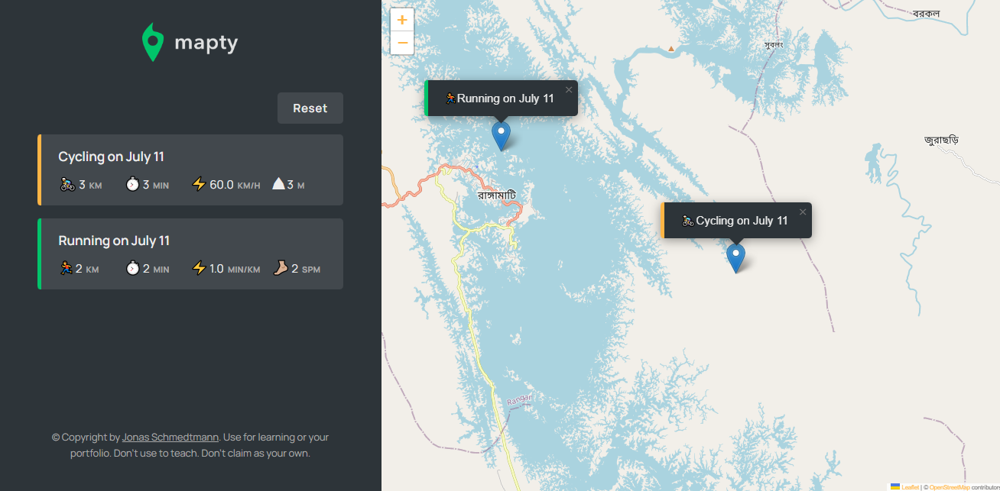

# Introduction

This  project is part of a course "The Complete JavaScript Course 2022: From Zero to Expert!" by Jonas Schmedtmann. Here we can keep track of our running/cycling based on our current location.

## Flowchart

### Screenshot of app

### Links

- [Live](https://mapty-rahidt.netlify.app/)

## Author

- LinkedIn - [@rahidt](https://www.linkedin.com/in/rahidt/)
